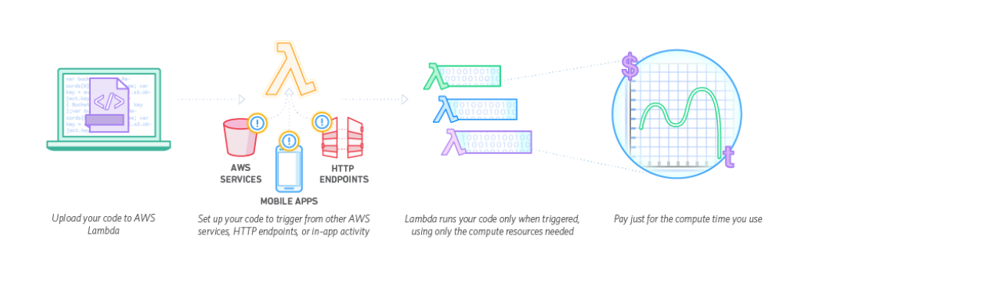
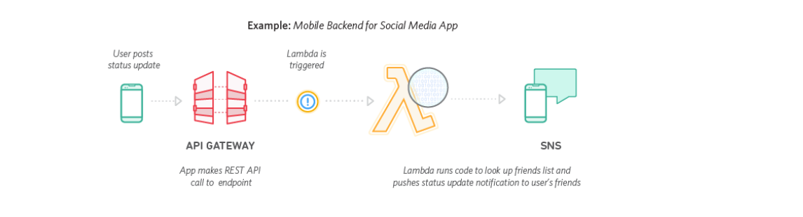

# Serverless-DynamoDB-Kinesis-Lambda
Serverless Architectures with Amazon DynamoDB and Amazon Kinesis Streams with AWS Lambda
SPL-51 Version 3.2.13

Lab Overview
This is a two-part lab. In part one of the lab, you create a Lambda function from a blueprint, create an Amazon Kinesis Stream, then trigger the function with data from your stream and monitor the process with Amazon CloudWatch.

In part two of the lab, you learn the basics of event-driven programming using Amazon DynamoDB, DynamoDB Streams, and AWS Lambda. You learn the process of building a real-world application using triggers that combine DynamoDB Streams and Lambda.

OBJECTIVES
By the end of this lab, you will be able to do the following:

Create an AWS Lambda function from a blueprint
Create an Amazon Kinesis Stream
Use Amazon CloudWatch to monitor Kinesis event data triggering your Lambda function
Create an Amazon DynamoDB table and insert items
Enable the Amazon DynamoDB Streams feature
Configure and troubleshoot Lambda functions

About the Technologies

AWS LAMBDA
Lambda is a compute service that provides resizable compute capacity in the cloud to make web-scale computing easier for developers. You can upload your code to AWS Lambda and the service can run the code on your behalf using AWS infrastructure. AWS Lambda supports multiple coding languages, including Node.js, Java, or Python. After you upload your code and create a Lambda function, AWS Lambda takes care of provisioning and managing the servers used to run the code.

In this lab, you use AWS Lambda as an event-driven compute service where AWS Lambda runs your code in response to changes to data in an SNS topic and an Amazon S3 bucket.

You can use AWS Lambda in two ways:

As an event-driven compute service where AWS Lambda runs your code in response to events, such as uploading image files as you see in this lab.

As a compute service to run your code in response to HTTP requests using Amazon API Gateway or API calls.
mobilebackend

Lambda passes on to you the financial benefits of Amazon’s scale. AWS Lambda executes your code only when needed and scales automatically, from a few requests per day to thousands per second. With these capabilities, you can use Lambda to easily build data processing triggers for AWS services like Amazon S3 and Amazon DynamoDB, process streaming data stored in Amazon Kinesis, or create your own back end that operates at AWS scale, performance, and security.

This lab guide explains basic concepts of AWS in a step by step fashion. However, it can only give a brief overview of Lambda concepts. For further information, see the official Amazon Web Services Documentation for Lambda at https://aws.amazon.com/documentation/lambda/. For pricing details, see https://aws.amazon.com/lambda/pricing/.

LAMBDA BLUEPRINTS
Blueprints are sample configurations of event sources and Lambda functions that do minimal processing for you. Most blueprints process events from specific event sources, such as Amazon S3 or DynamoDB. For example, if you select an s3-get-object blueprint, it provides sample code that processes an object-created event published by Amazon S3 that Lambda receives as parameter.

When you create a new AWS Lambda function, you can use a blueprint that best aligns with your scenario. You can then customize the blueprint as needed. You do not have to use a blueprint (you can author a Lambda function and configure an event source separately).

AMAZON DYNAMODB
Amazon DynamoDB is a fast and flexible NoSQL database service for all applications that need consistent, single-digit millisecond latency at any scale. It is a fully managed database and supports both document and key-value data models. Its flexible data model and reliable performance make it a great fit for mobile, web, gaming, ad-tech, IoT, and many other applications. For further information, see the official Amazon Web Services Documentation for DynamoDB at https://aws.amazon.com/documentation/dynamodb/.

AMAZON KINESIS
Amazon Kinesis is a fully managed service for real-time processing of streaming data at massive scale. Amazon Kinesis can collect and process hundreds of terabytes of data per hour from hundreds of thousands of sources, allowing you to easily write applications that process information in real-time, from sources such as web site click-streams, marketing and financial information, manufacturing instrumentation and social media, and operational logs and metering data.

With Amazon Kinesis applications, you can easily send data to a variety of other services such as Amazon Simple Storage Service (Amazon S3), Amazon DynamoDB, Amazon Lambda, or Amazon Redshift. In a few clicks and a couple of lines of code, you can start building applications which respond to changes in your data stream in seconds, at any scale, while only paying for the resources you use. For further information, see the official Amazon Web Services Documentation for Kinesis at http://aws.amazon.com/documentation/kinesis/.

